# **Midterms Project Assignment Description**

## **CatTheCat CTF Registration Form**

| Key          | Value                                                          |
| ------------ | -------------------------------------------------------------- |
| Title        | CatTheCat CTF Team Open Recruitment                            |
| Team Members | [spuun](https://github.com/spuuntries) (Faiz, NRP: 5054231013) |
| Thumbnail    | 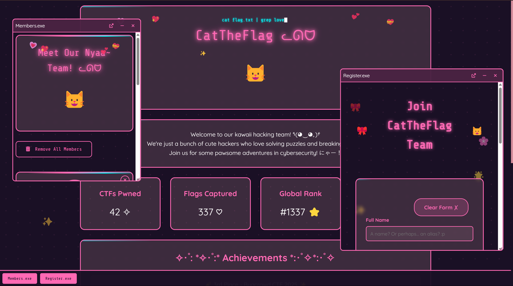                                       |
| Youtube Demo | [https://youtu.be/vPg1wdtAnGw](https://youtu.be/vPg1wdtAnGw)   |

## **Description**

For this project, I implemented a homepage for a (fictional) CTF team named "CatTheCat", along with an Open Recruitment registration form and a Member List.

### **Home Page**

The idea for this page layout was inspired by some web pages I've been seeing recently. Namely, [https://libdb.so/](https://libdb.so/) and [https://zvava.org/](https://zvava.org/).

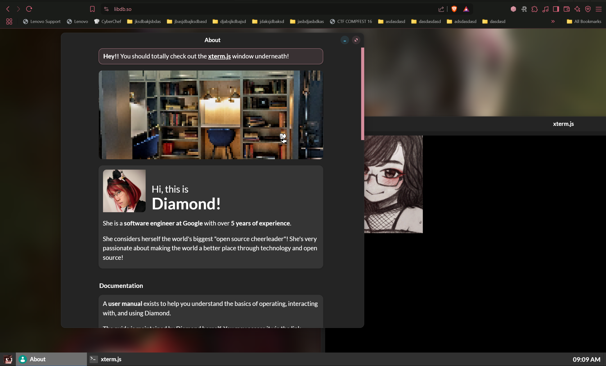
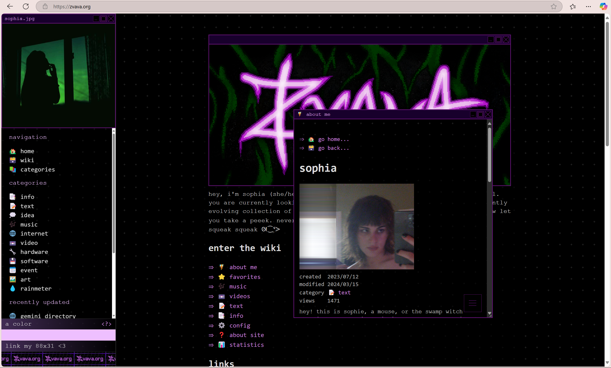

So I decided to try to follow in their footsteps in getting that nice window-based pagination.

The windows are all interactive and resize-able. I implemented this using `<iframe>`s and a good amount of Javascript wizardry to update the absolute positioning via HTML attributes.

### **Registration Form**

For the registration form, I implemented the validations as per requested by the requirements document.

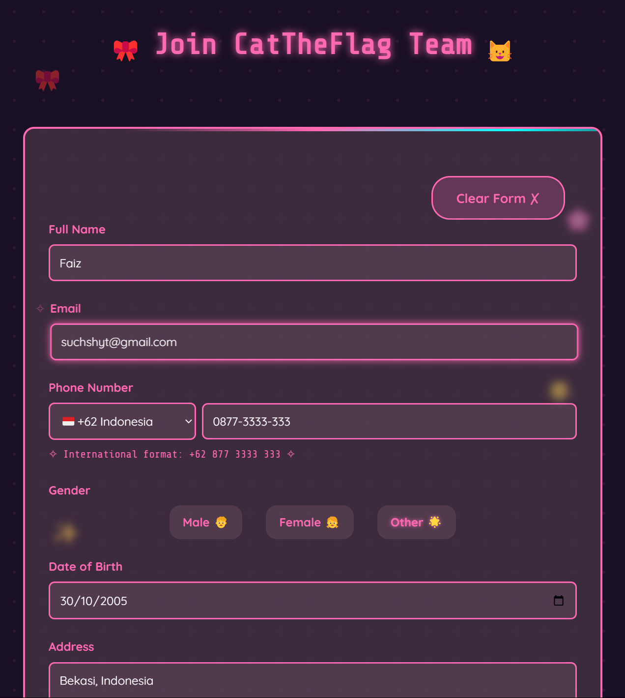

However, since the whole "store and obtain data from `localStorage`" thing didn't really make sense to me logic-wise for a registration forms app (you'd need to be accepted first before being in the members page, so...), I implemented `localStorage` as a "temporary storage" thing so that it'd be able to recover after refresh (a la Google Forms).

To ensure the fields are filled, I used a `required` attribute on all the inputs, with their respective standardized types
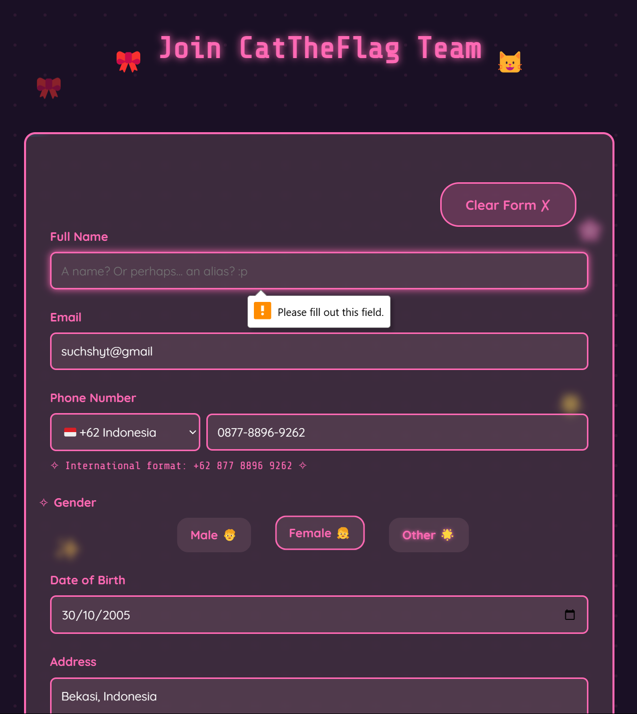
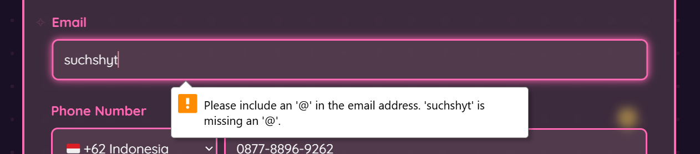

I also added a bit of a parsing thing for the phone number, using `libphonenumber-js`.

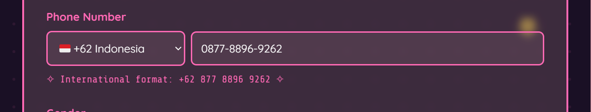

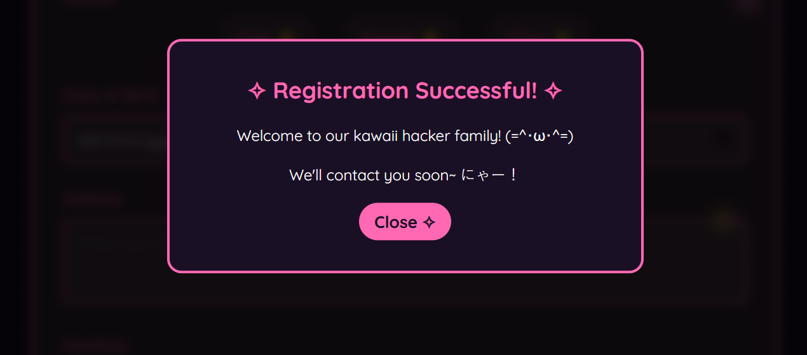

### **Members List**

Since I didn't use `localStorage` as the "pseudo-backend", I used a static json file at `./members.json` with some placeholder values to render the members.

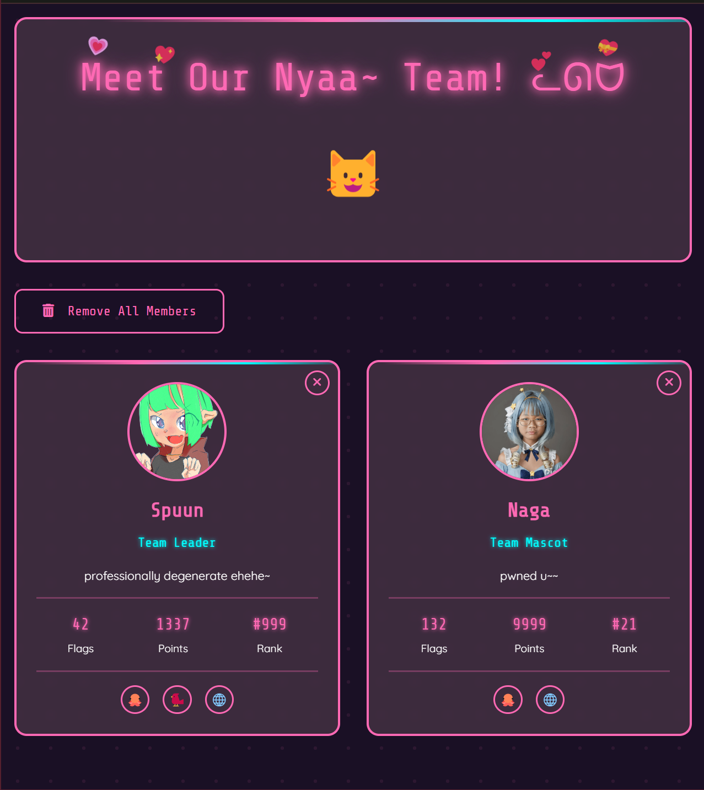

The buttons allow for either getting rid of the entire thing, or just one-by-one.

### **Responsivity**

To ensure mobile-friendliness, I implemented, ...basically all of the layouting with either `grid` or `flex`.

Namely, for buttons like these, I set it up as a flex thing so it'll break into a fill-based layout such that it's easier to reach on mobile aspect ratios.

Desktop:  
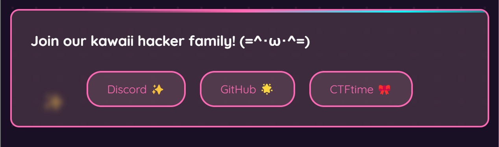
Mobile:  
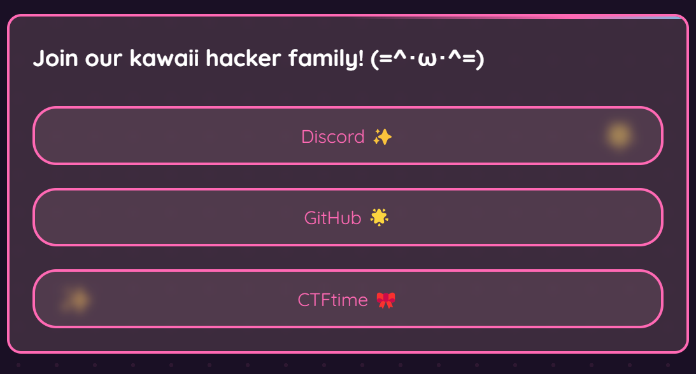

Desktop:  

Mobile:  
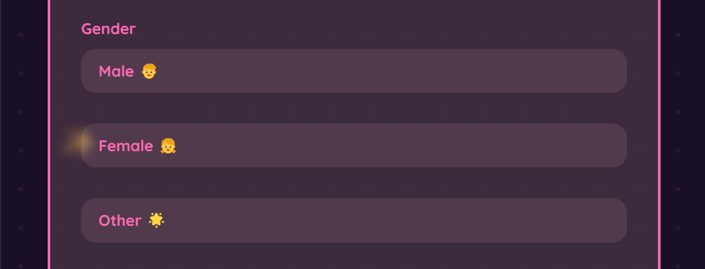

Grids are also implemented for fixed-size stuff that needs to break on smaller sizes.

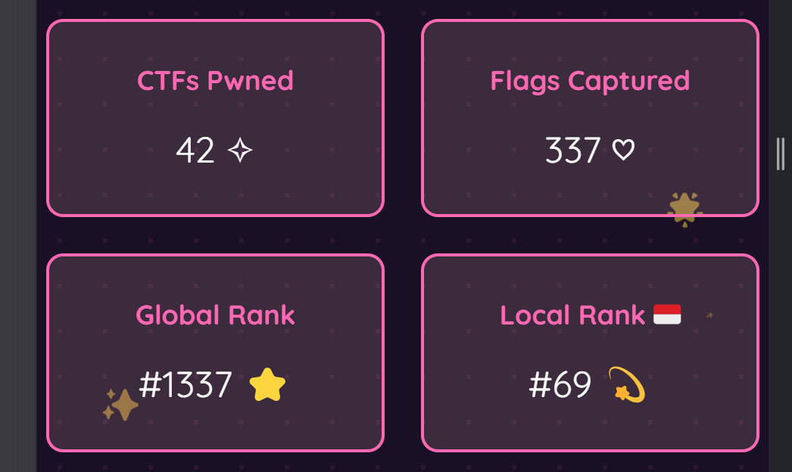

On smaller:  
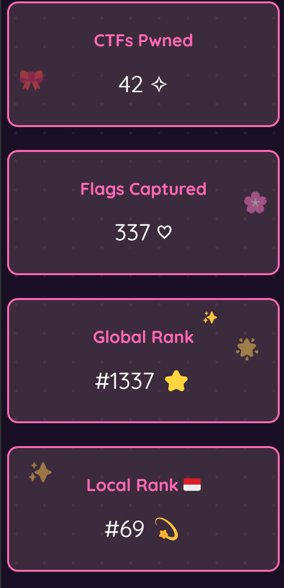

The windows-like interface is also collapsed into a button interface when on mobile, this is due to the fact that the dragging behavior seemed to be pretty inconsistently-implemented in different browsers, especially mobile, so I decided against having it work on mobile at all.

Desktop:  
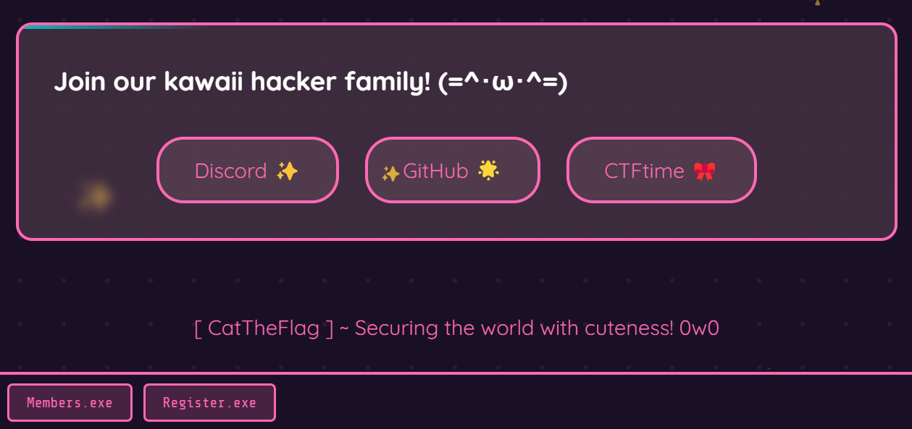

Mobile:  
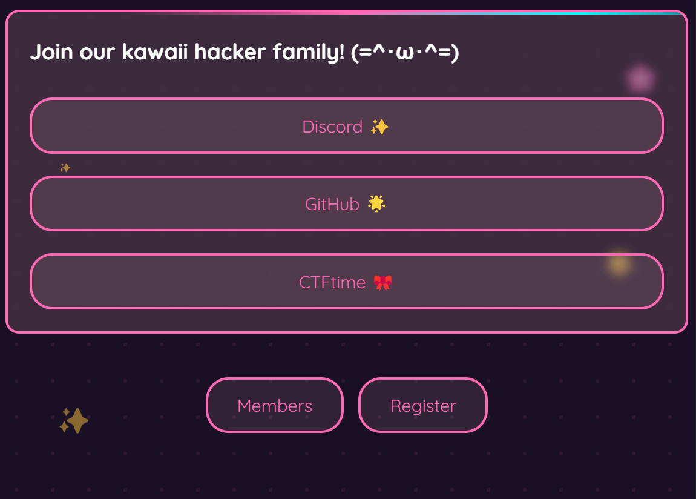
