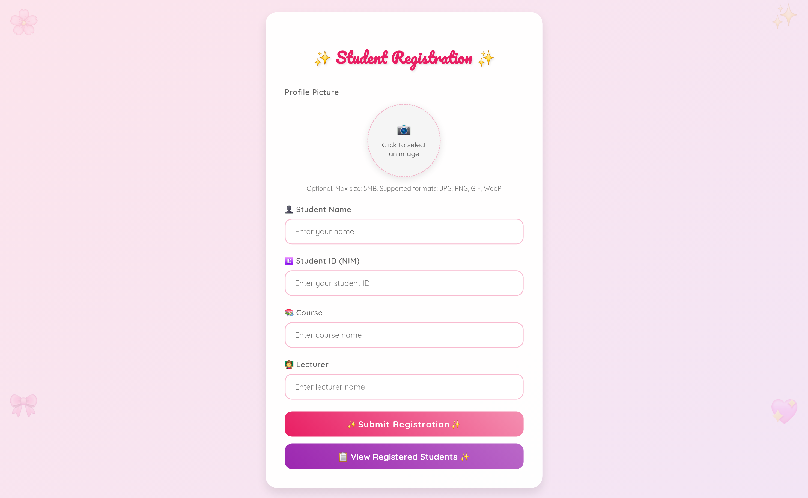
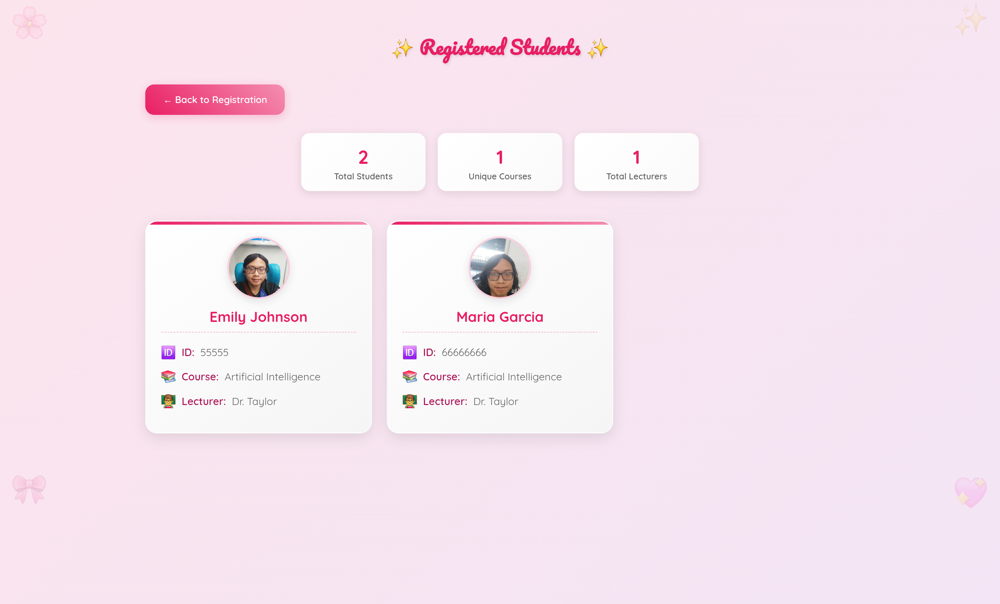
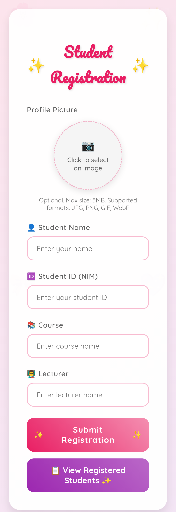
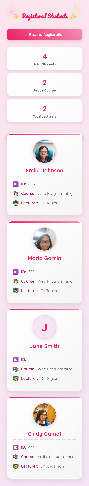
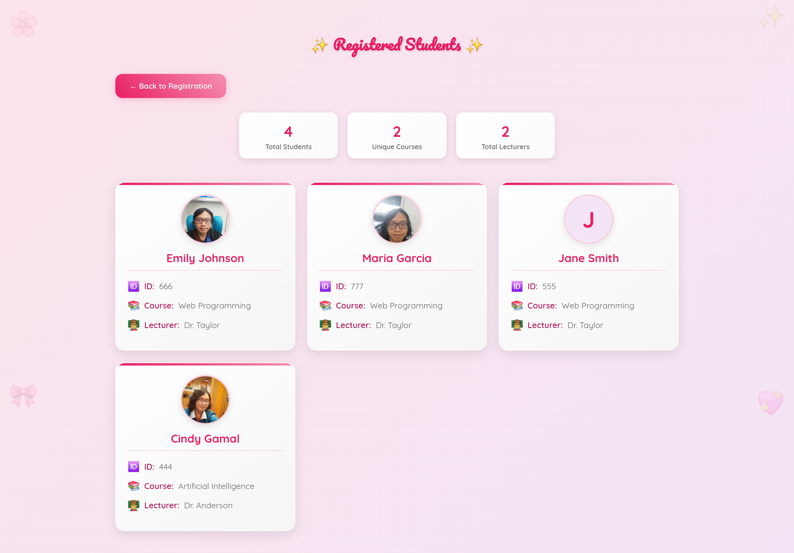
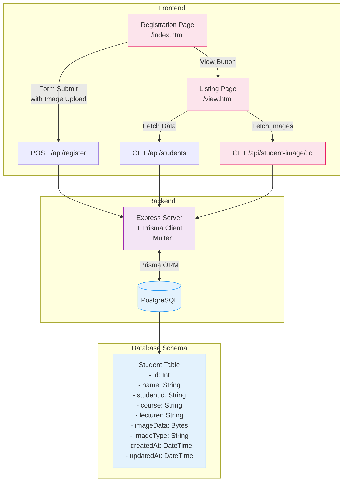

# **Web Programming 9th Assignment**

Faiz Muhammad Kautsar  
5054231013

View the deployed version at: [https://tugas10.spuun.art/](https://tugas10.spuun.art/)

I recycled the structure from the previous [`tugas-9`](../tugas-9/) assignment, set up a PostgreSQL database via [Supabase](supabase.com/), connected via the [Prisma ORM](https://www.prisma.io/). (https://tugas-10-sigma.vercel.app/).

This is pretty much a recycle of the previous assignment, but I added a profile picture submission field. I used Prisma ORM to do the schema. As per the previous assignment, I had to modify some of the setup since the ORM requires us to rebuild the interface module component to prevent outdated cached modules (which would be at `/generated`, I set this to the `.gitignore` to omit it from commits intentionally).

Like the previous assignment, the UI designs _are_ responsive, with media queries coded in.

To do the media handling, I used multer and a multipart form data, shoving the Bytes directly into my postgres at Supabase. (This isn't really the recommended approach for most apps, but since this is a pretty limited scope, and Vercel's setup wouldn't have allowed me to save the files on-disk (in fact, had to migrate the schema cuz of this realization), this is the quick hacky approach I took :p)

Also, I added a default pfp for those who didn't select a pic.

Currently, the flow looks something like this:

