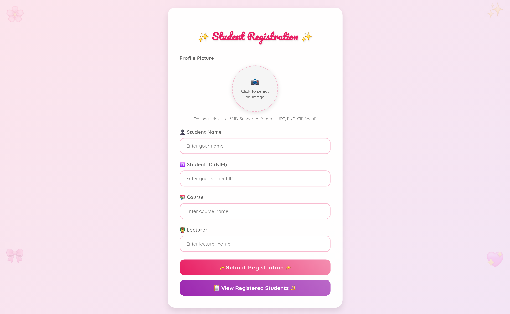
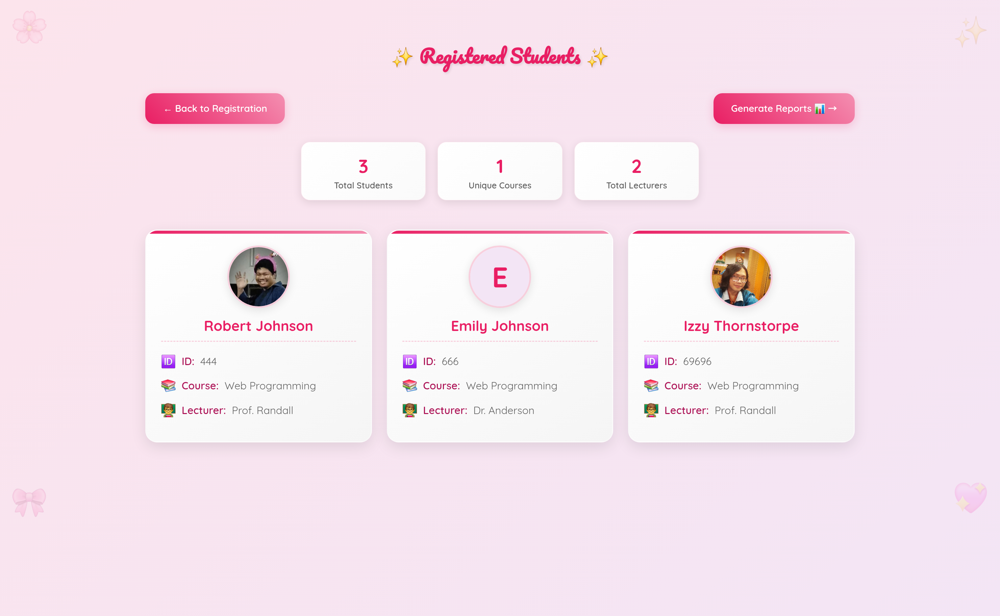
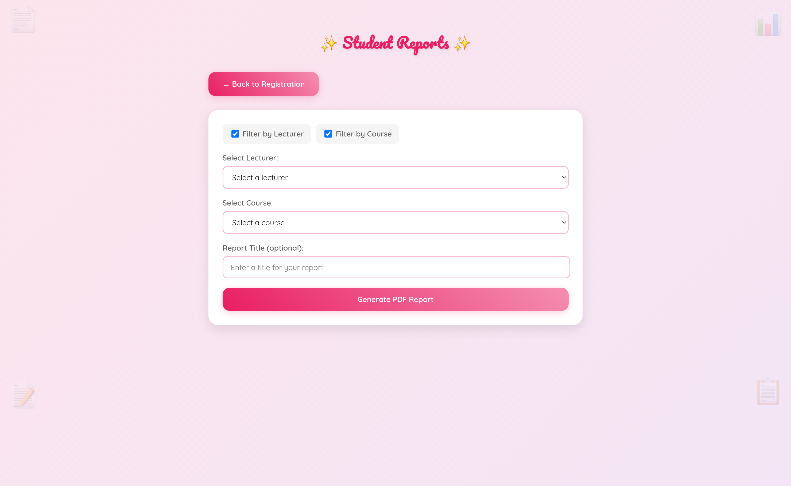
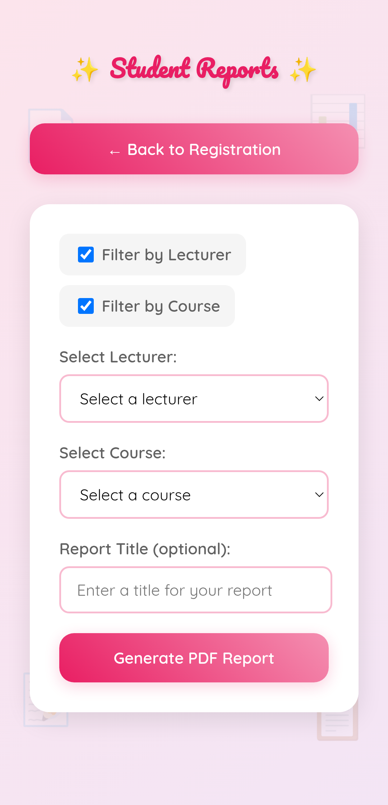
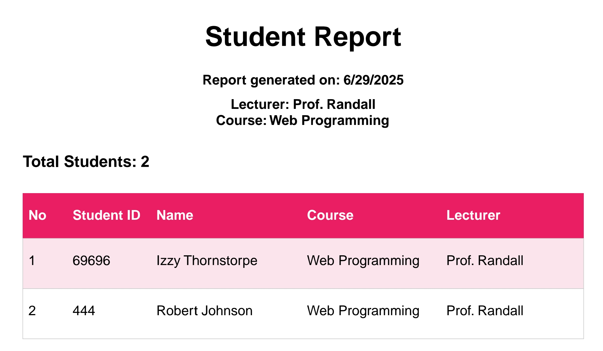
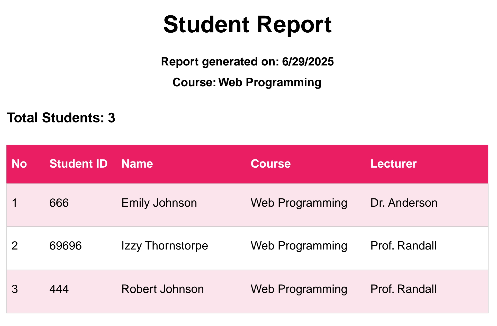
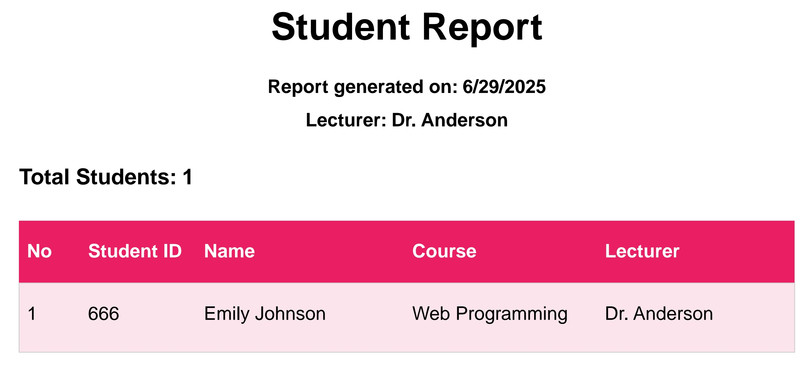
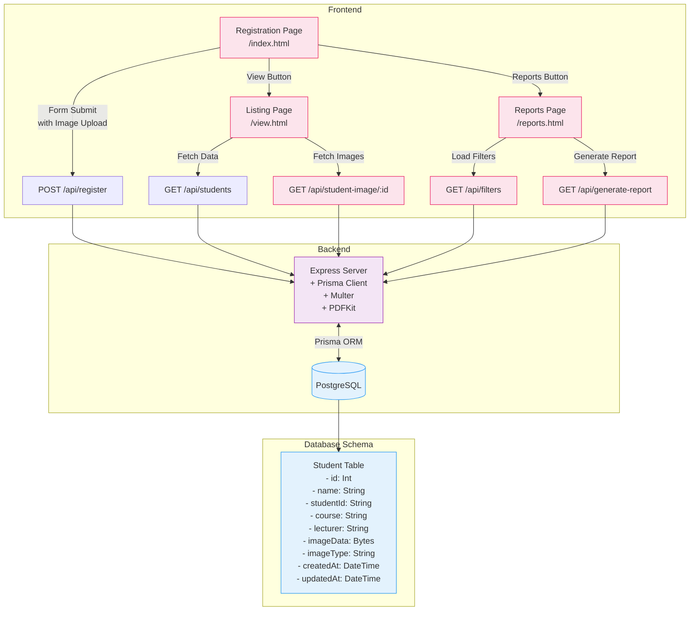

# **Web Programming 11th Assignment**

Faiz Muhammad Kautsar  
5054231013

View the deployed version at: [https://tugas11.spuun.art/](https://tugas11.spuun.art/)

I recycled the structure from the previous [`tugas-10`](../tugas-10/) assignment, set up a PostgreSQL database via [Supabase](supabase.com/), connected via the [Prisma ORM](https://www.prisma.io/). (https://tugas-11-pi.vercel.app/).

Like the previous assignment, the UI designs _are_ responsive, with media queries coded in.

Since this is pretty much a recycle of the previous assignment, I really only added a "generate report" feature. I implemented this with pdfkit.

You can filter by either or both course and lecturer, and get a PDF of all students attending said class. Here are some samples:

Currently, the flow looks something like this:

