# **Web Programming 2nd Assignment**

This assignment that I submitted features a responsive design, below I show for all devices which I coded breaks/media queries for.

View the deployed version at: https://pweb.spuun.art/tugas-2/

---

On a laptop, or whatever desktop-esque device you may have.

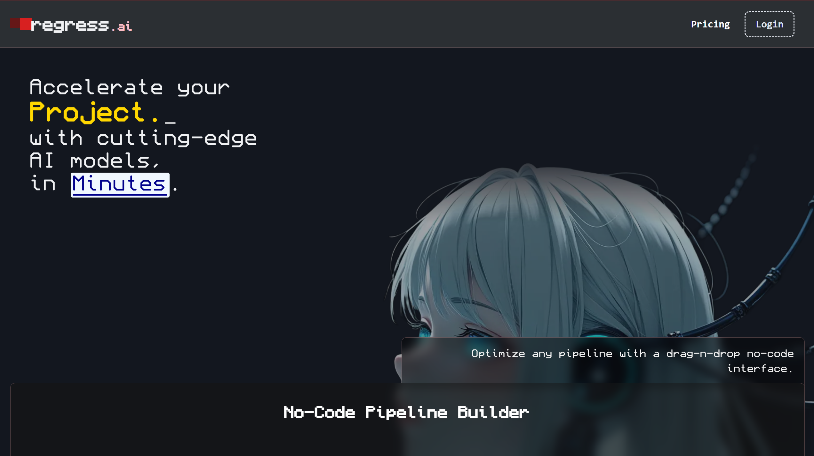
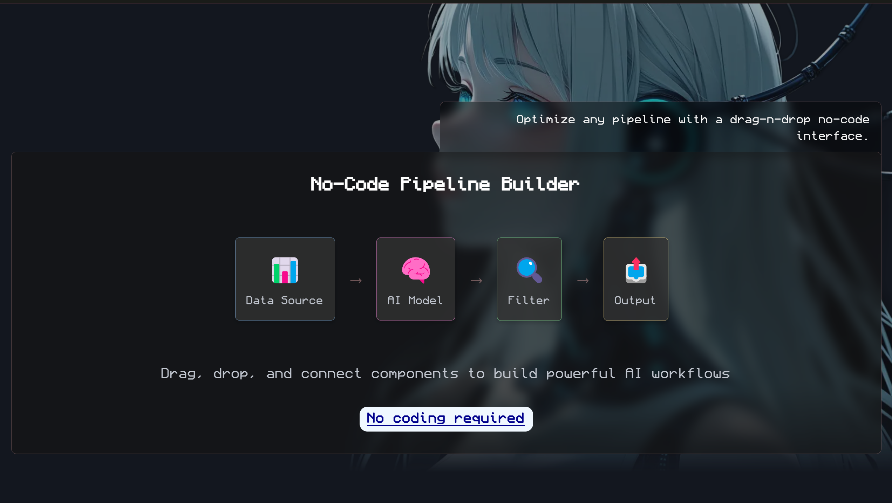
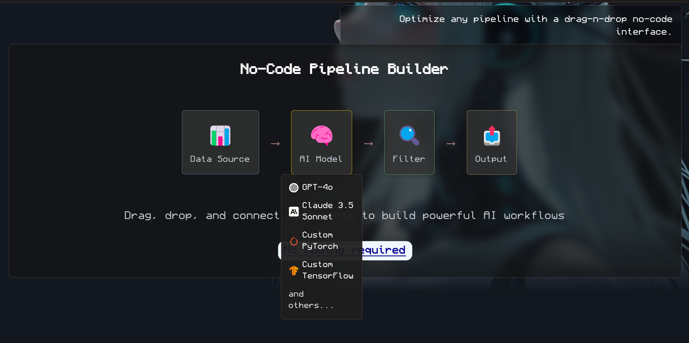
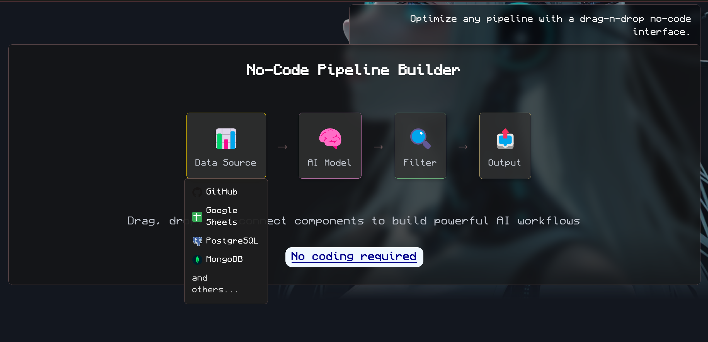
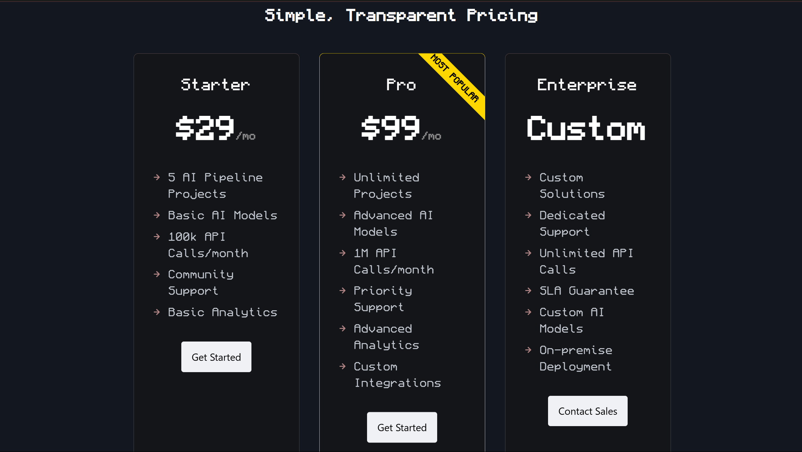

---

On a tablet.

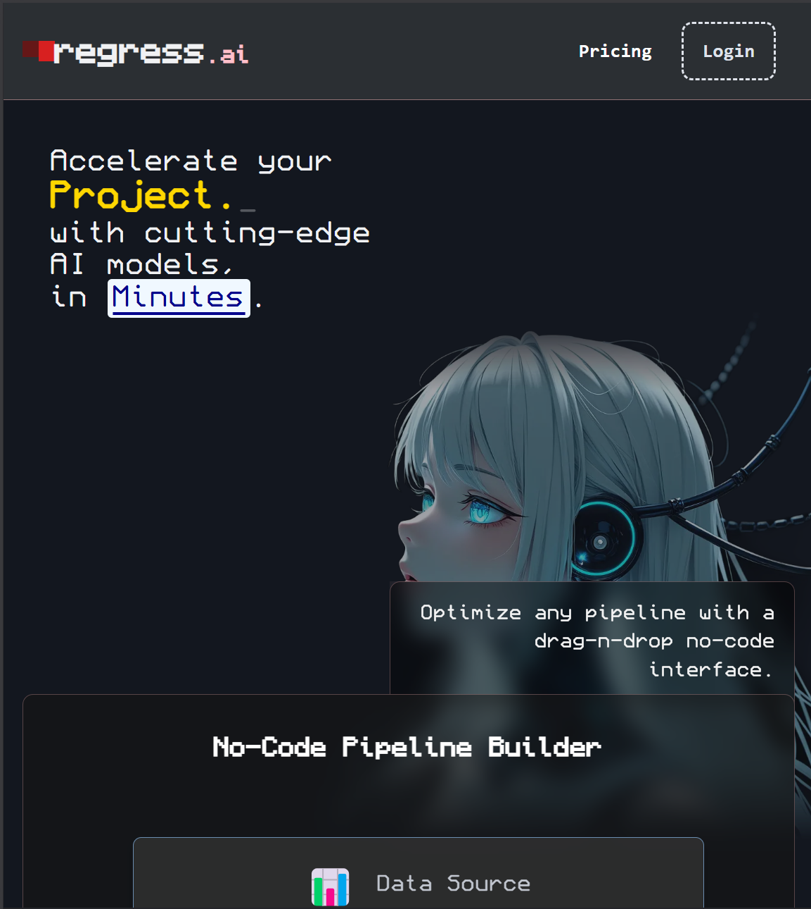
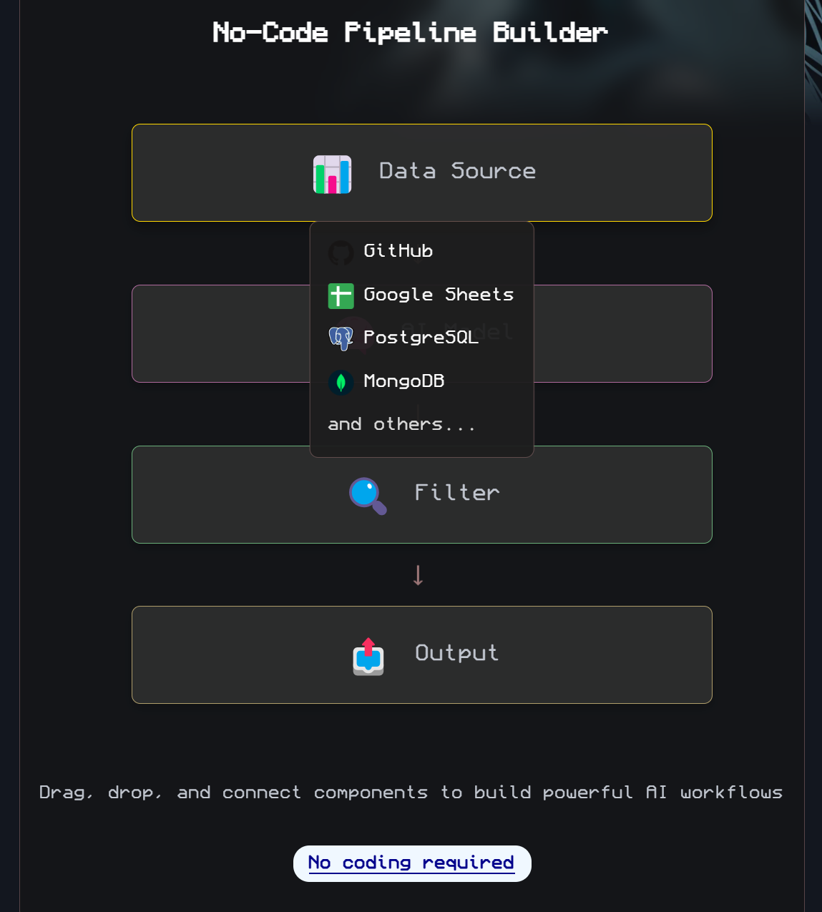
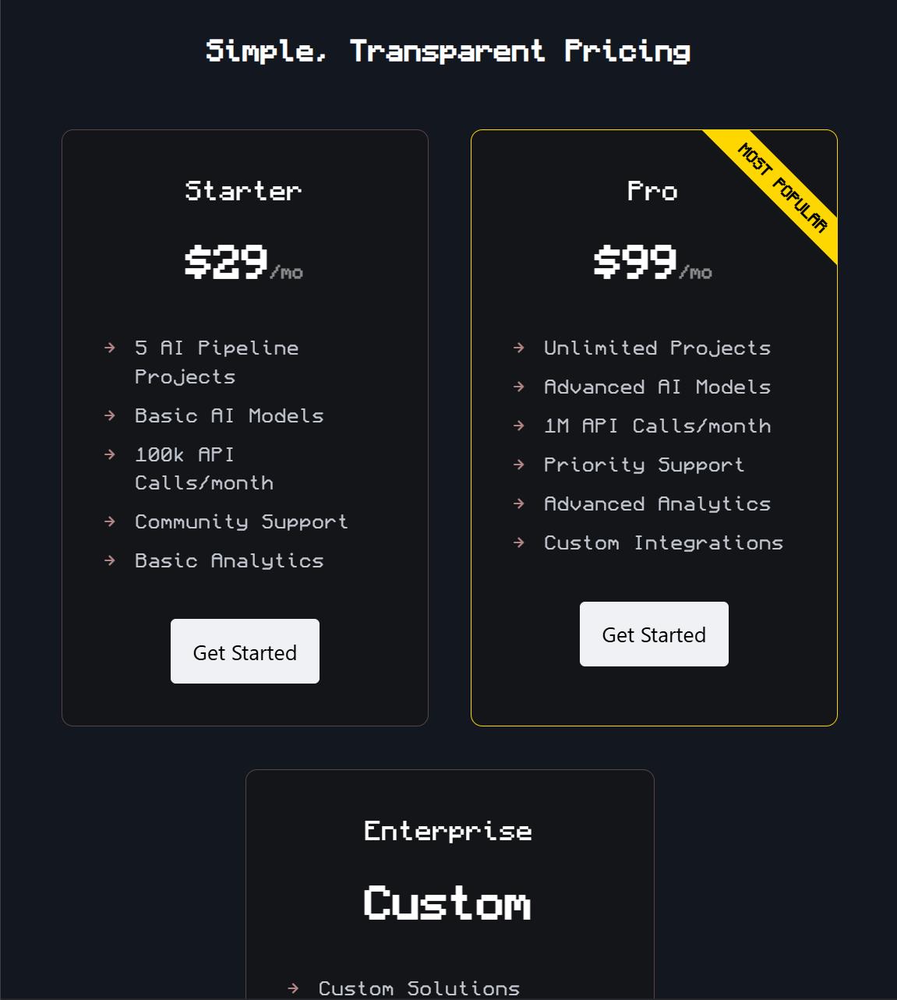

---

On a medium-sized phone.

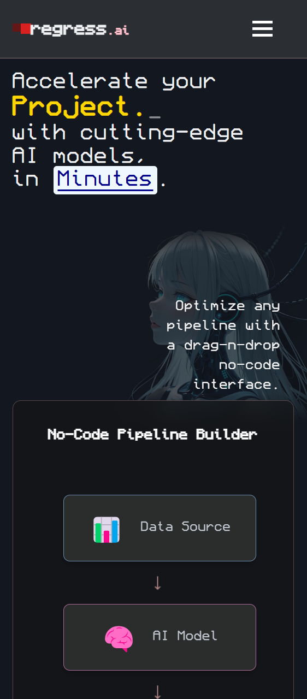
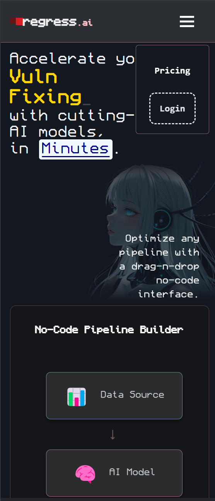
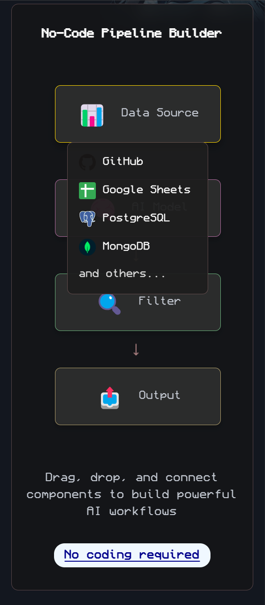
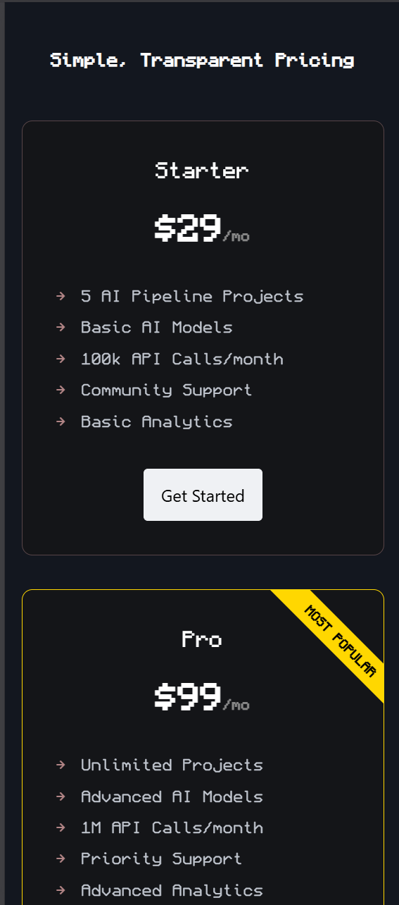

---

On a small-sized phone.

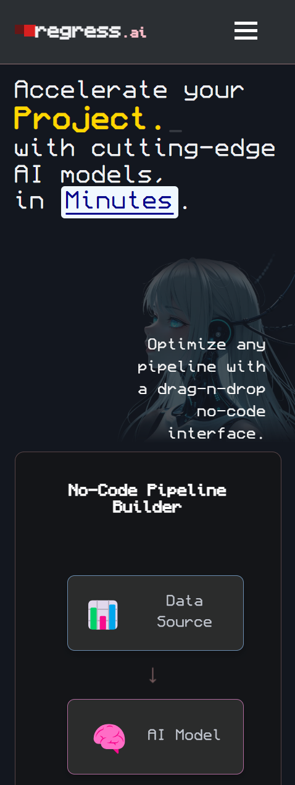
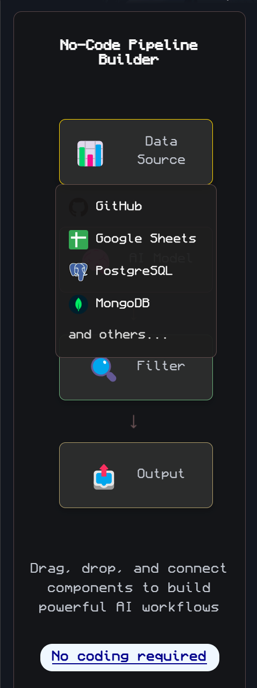
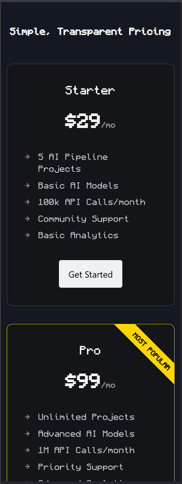
