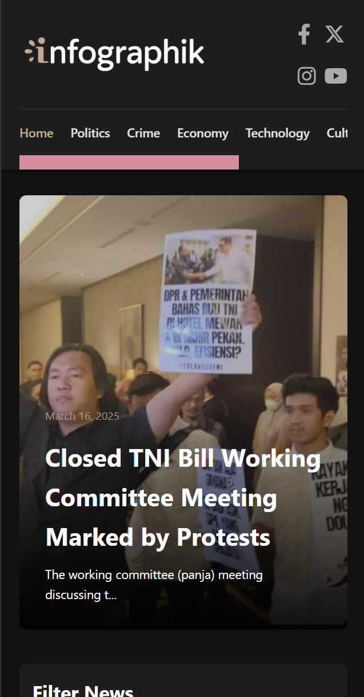
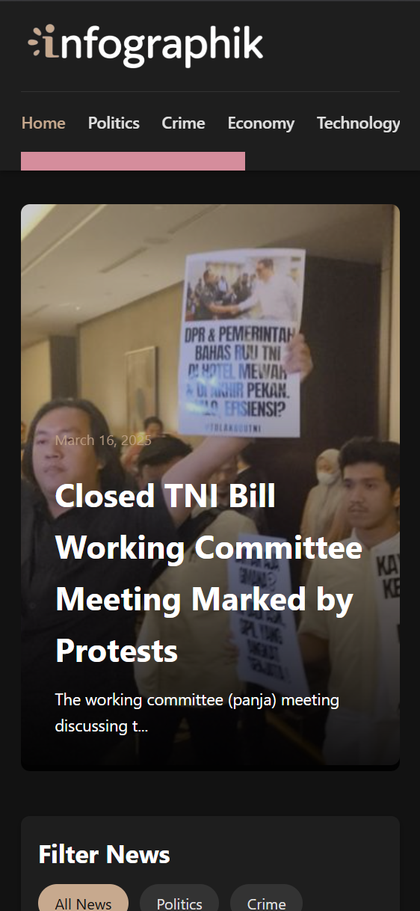

# **Web Programming 3rd Assignment**

This assignment that I submitted features a responsive design, below I show for all devices which I coded breaks/media queries for.

---

On a laptop, or whatever desktop-esque device you may have.

---

On a tablet.

---

On a medium-sized phone.

---

On a small-sized phone.

