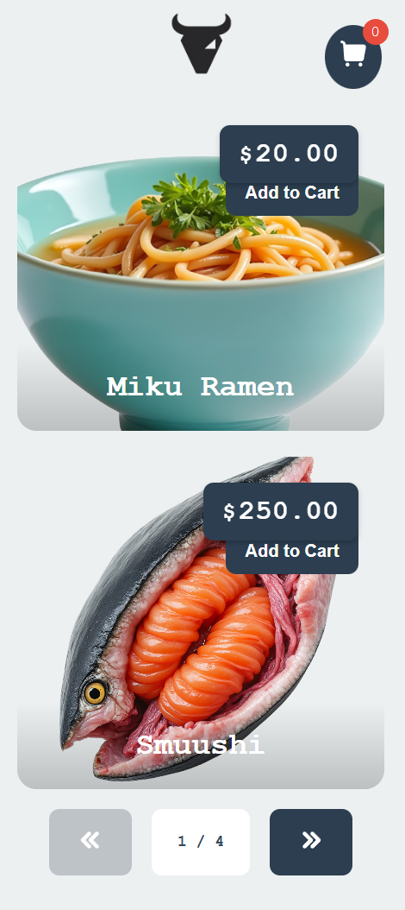
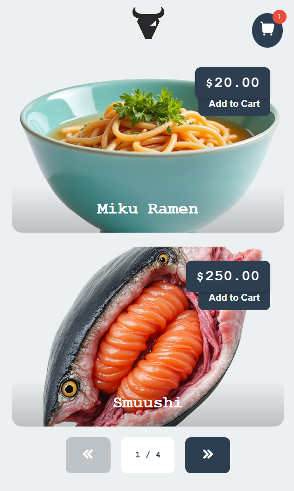
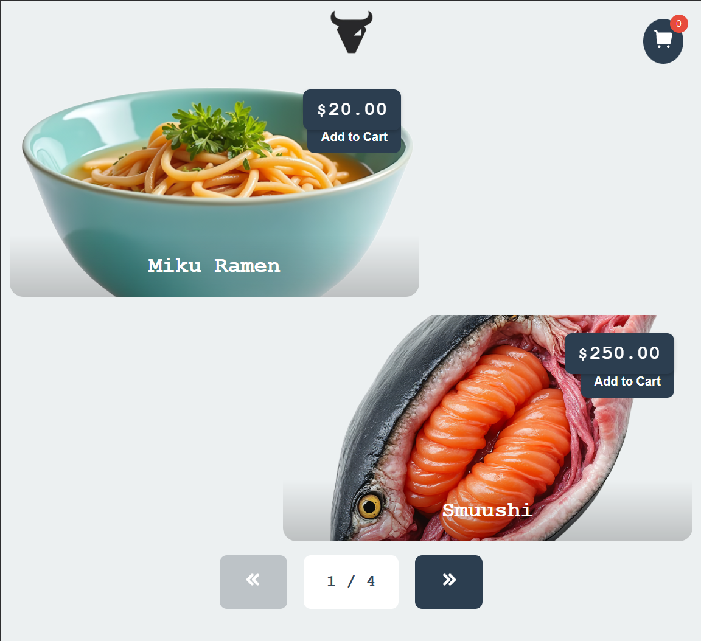
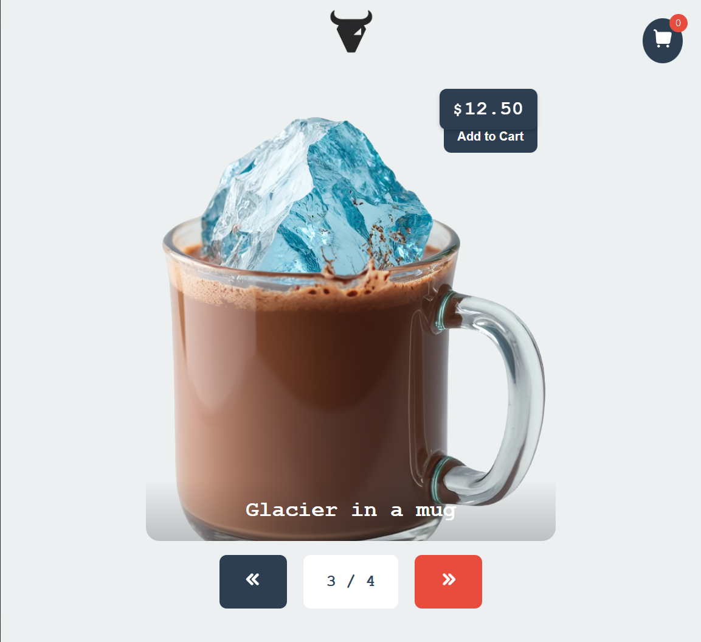
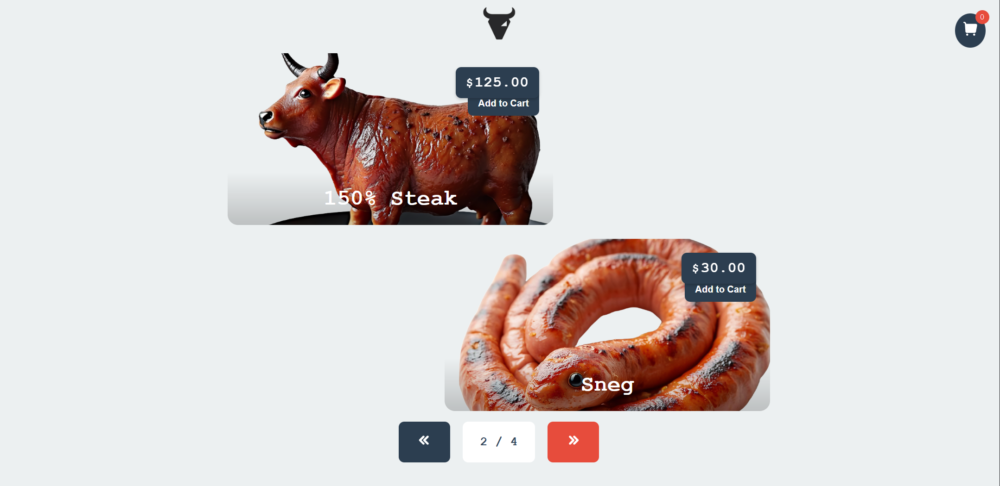

# **Web Programming - Assignment 4 HTML5**

Faiz Muhammad Kautsar  
5054231013

View the deployed version at: https://pweb.spuun.art/tugas-4/

To be clear, [../tugas-3/](../tugas-3/) was already under an HTML5 web page structure, however since the assignment explicitly asked for an HTML5 web page, and I didn't want to be lazy and just, resubmit the previous assignment here, so I made a basic restaurant menu webpage.

This uses, again, like before, responsive design, with HTML5 semantic tags. I've also added this cart functionality, although the actual checkout feature is otherwise nonfunctional atm.

I added a "pseudo-backend" like the previous assignment, via a JSON to emulate a REST API which would otherwise return the menus on fetch.

The HTML5 semantic tagging that I used specifically are `<header>`, `<main>`, `<section>`, and `<article>` tags, although if I had to be honest, I liked the previous assignment's use of them. The semantic application of these tags aren't as coherent when used for this use case imho.

For the icons I grabbed them off iconify, custom illustrations generated via FLUX on replicate.

---

Some documentation of the responsive design:

Small mobile phone:  

Large mobile phone:  

Phone Single-item:  

Tablet:

Single-item Tablet:  

(Desktop is otherwise the same)

