# **Web Programming 6th Assignment**

Faiz Muhammad Kautsar  
5054231013

View the deployed version at: https://pweb.spuun.art/tugas-6/

This assignment that I submitted features a few pages, the link up there goes to an index page where you can view the individual pages. Below I show some screenshots of the things implemented.

---

## 📄 Index Page

This is basically just, a carousel of iframes I decorated, I also added that collapsible sidebar and visiting buttons for navigating to the individual pages.

Although you _can_ interact w/ them on here as well.

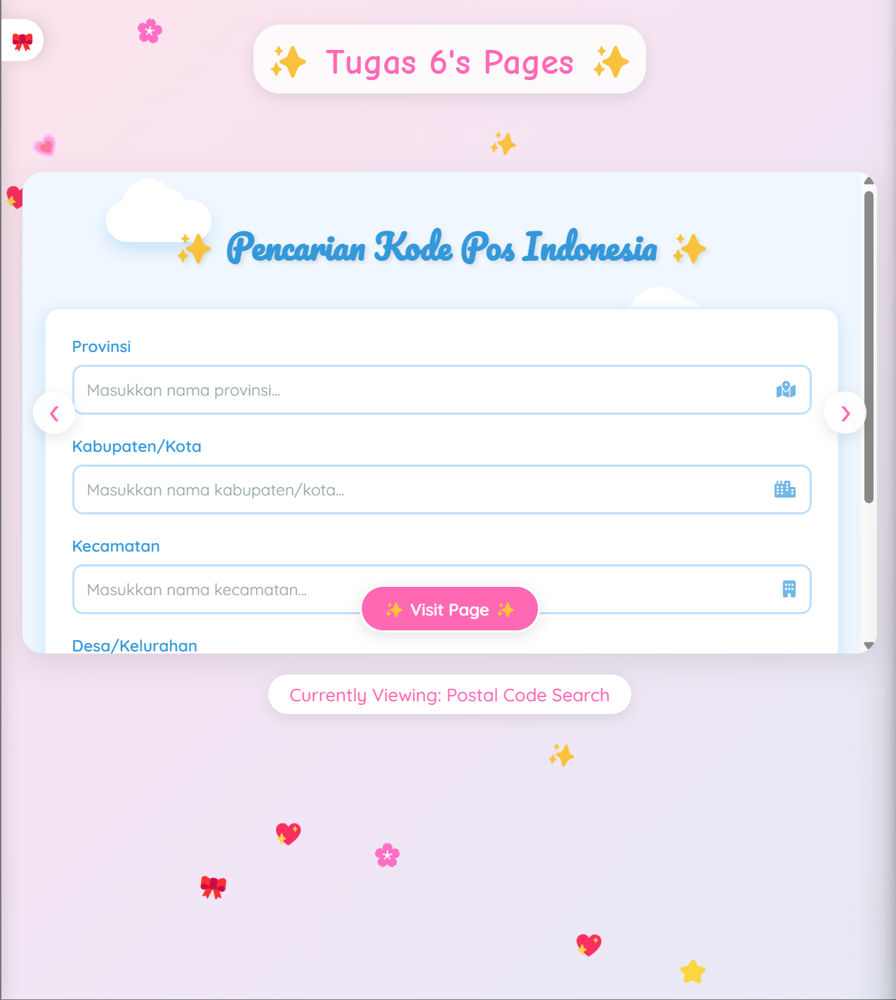
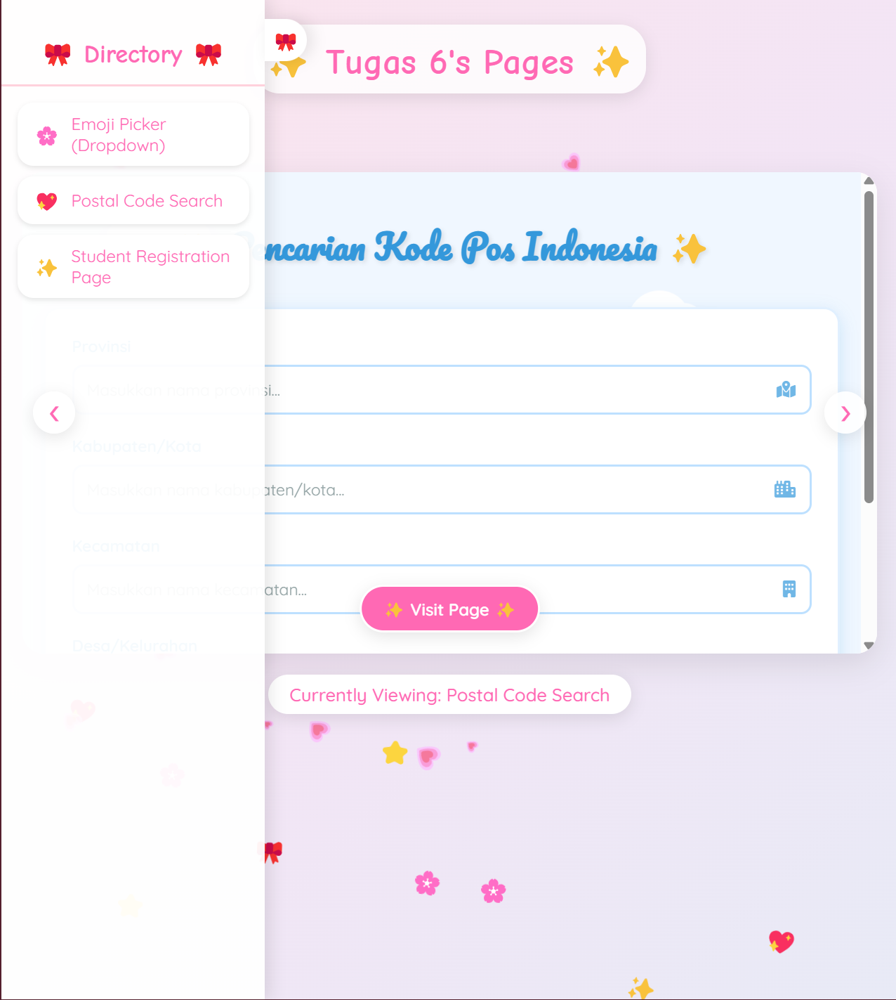

---

## 👩‍🎓 Student Registration

For registration we were tasked w/ autocomplete, so I did that, for the name, course, and lecturer inputs.

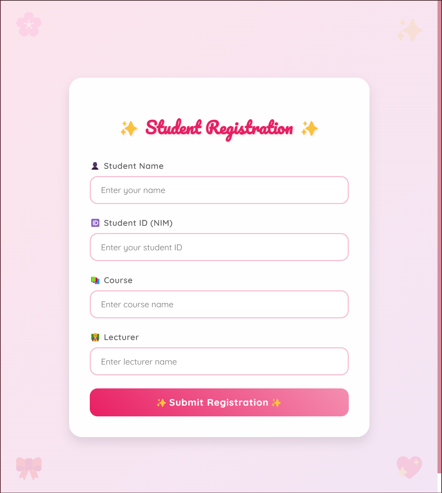
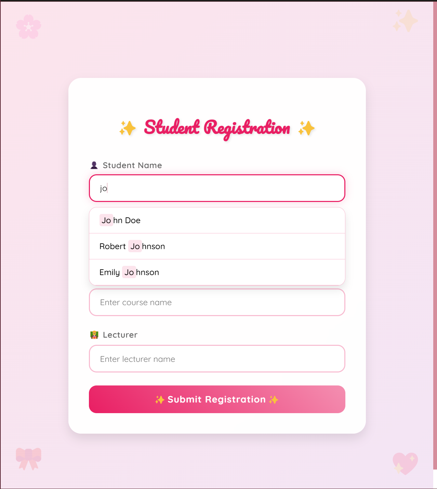
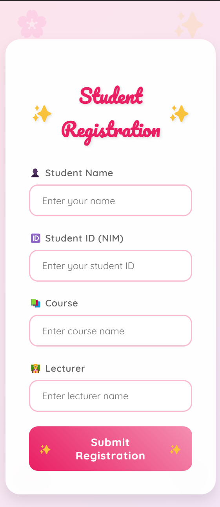

As a bonus this one's also responsively designed.

---

## 📫 Postal Code Search

Did this one by shooting to the API at https://github.com/sooluh/kodepos (https://kodepos.vercel.app).

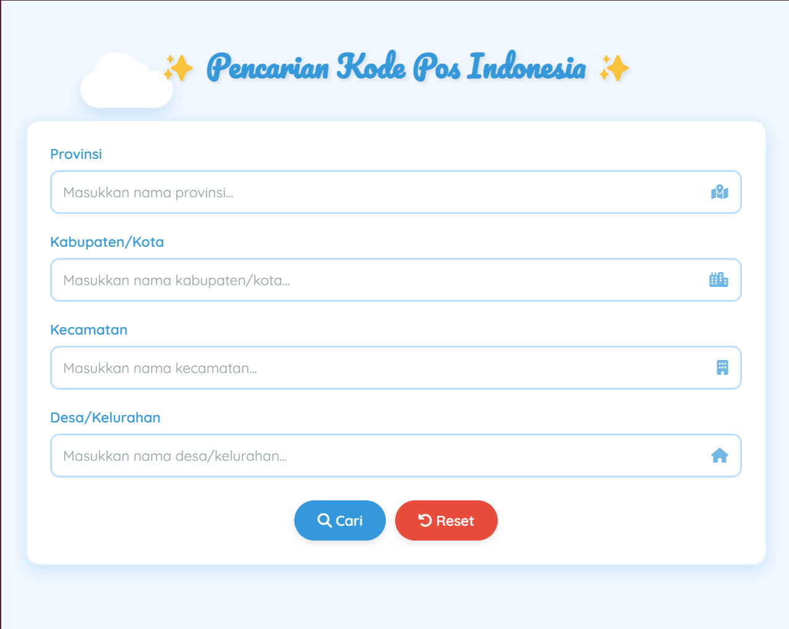
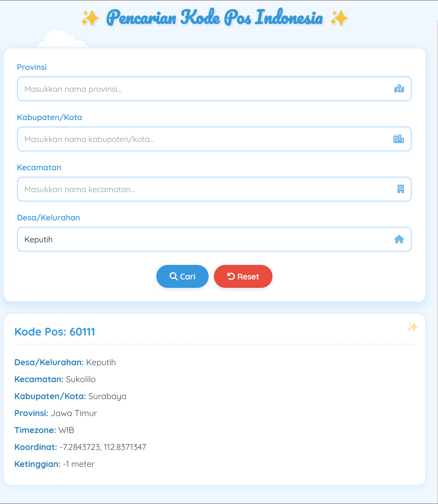
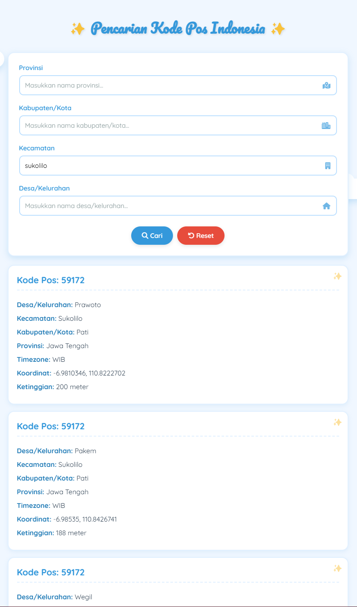

Also designed responsively

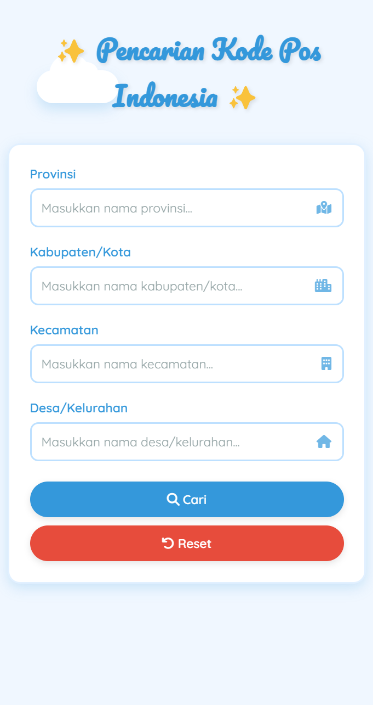

---

## 💖 Emoji Picker (Dropdown Implementation)

Essentially just implemented a dynamic dropdown which you can use to select emojis and preview them.

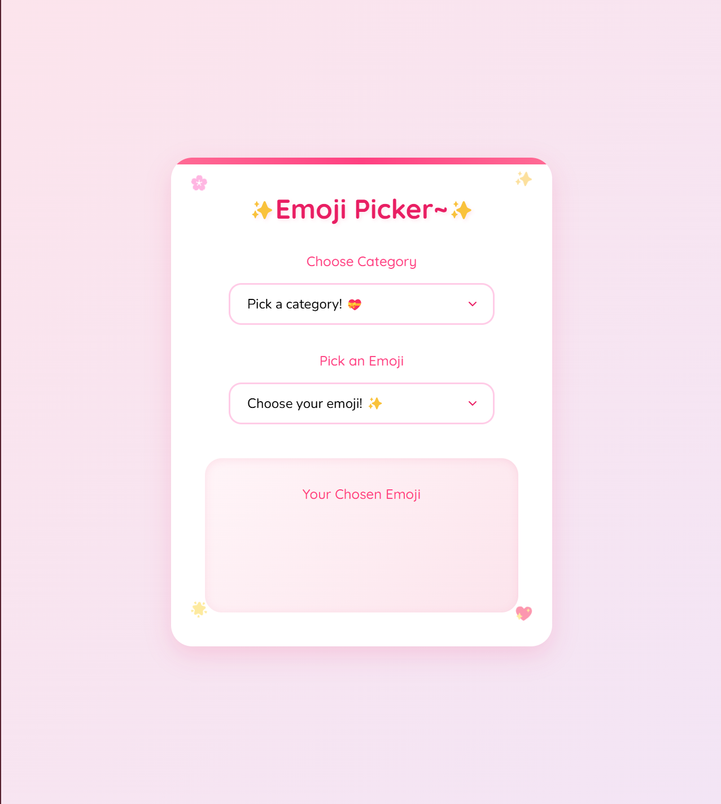
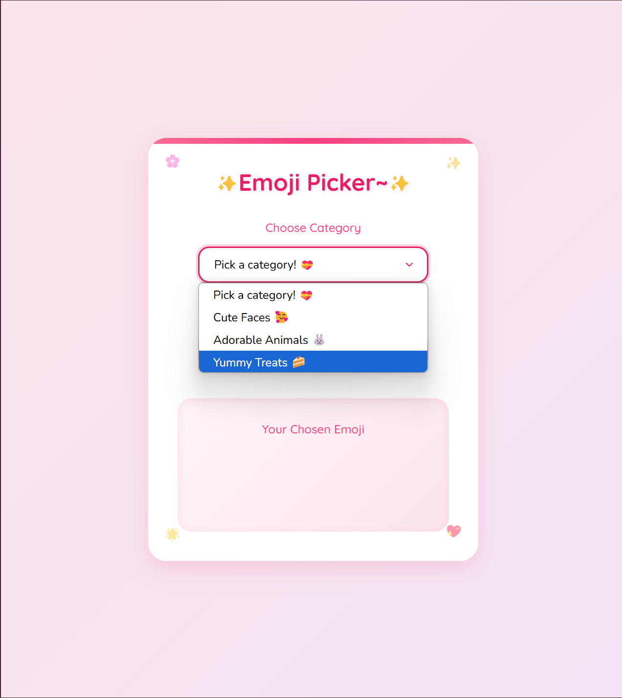
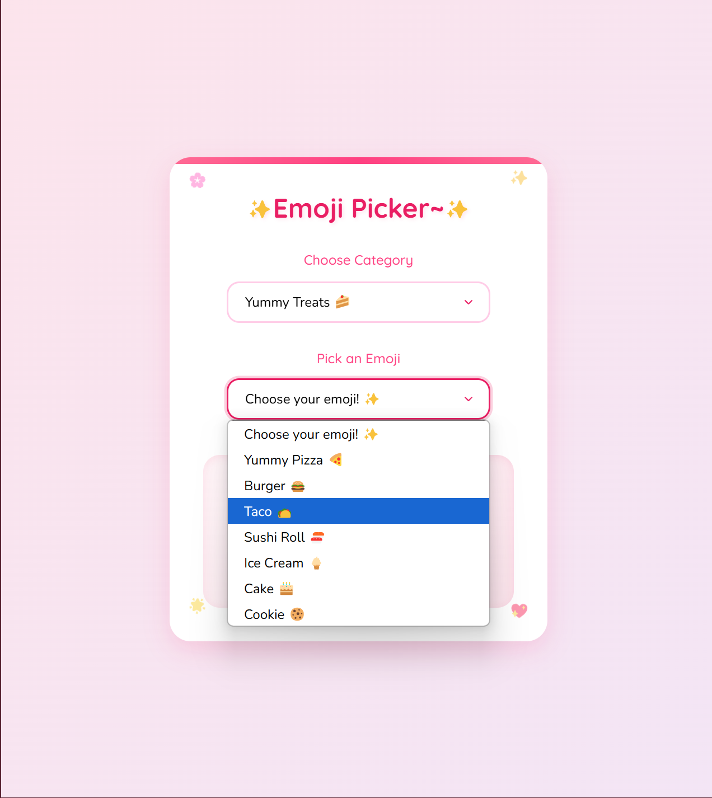
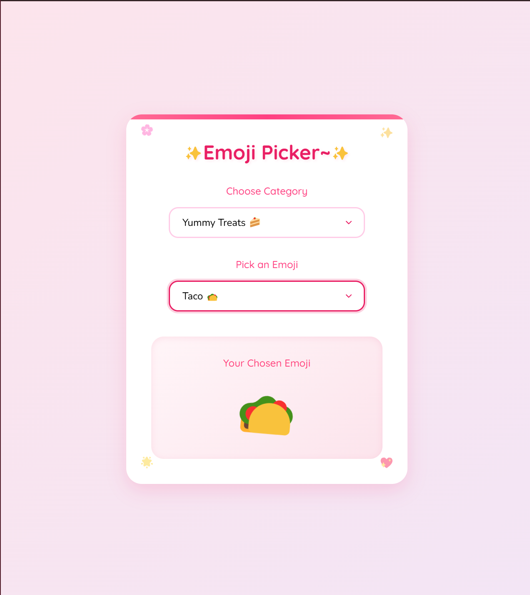
