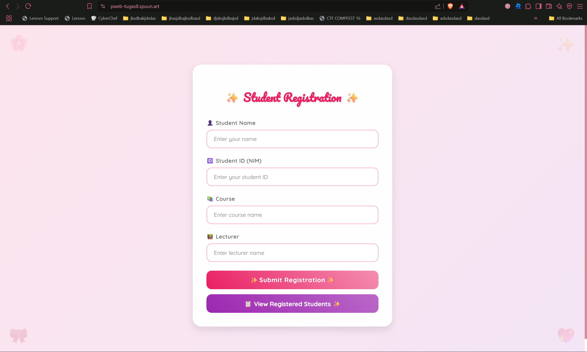
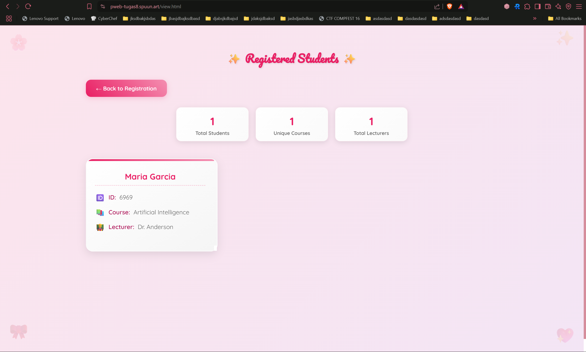
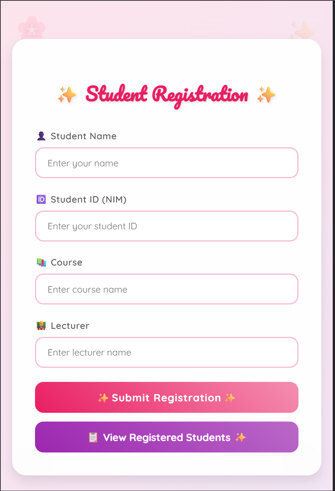
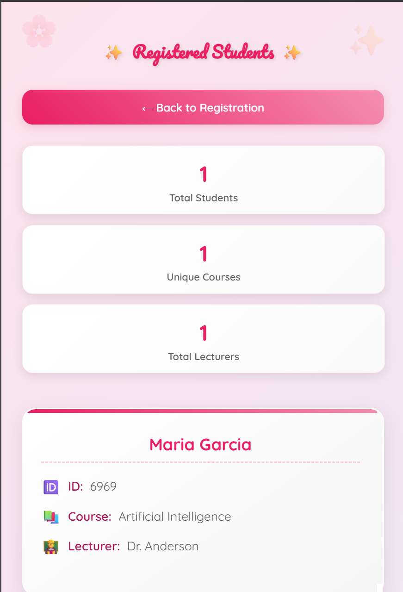
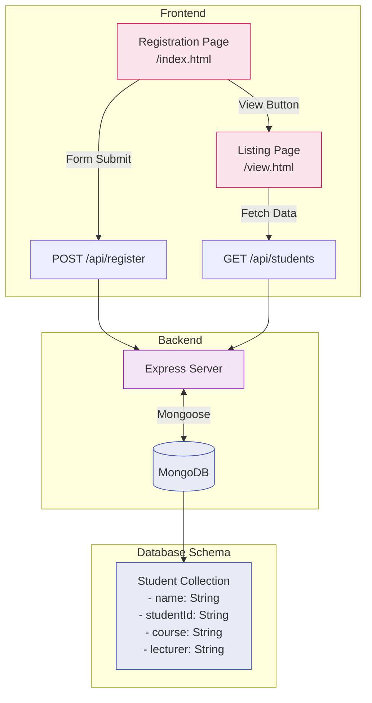

# **Web Programming 8th Assignment**

Faiz Muhammad Kautsar  
5054231013

View the deployed version at: [https://pweb-tugas8.spuun.art/](https://pweb-tugas8.spuun.art/)

I recycled the FE from the previous [`tugas-6`](../tugas-6/) assignment, added a backend implemented in Express deployed on [Vercel](https://vercel.com/) (https://tugas8-pweb.vercel.app/), with a database deployed at a [Mongodb Atlas](https://www.mongodb.com/atlas) cluster, interfaced via Mongoose.

The UI designs _are_ responsive, with media queries coded in.

Currently, the flow looks something like this:

