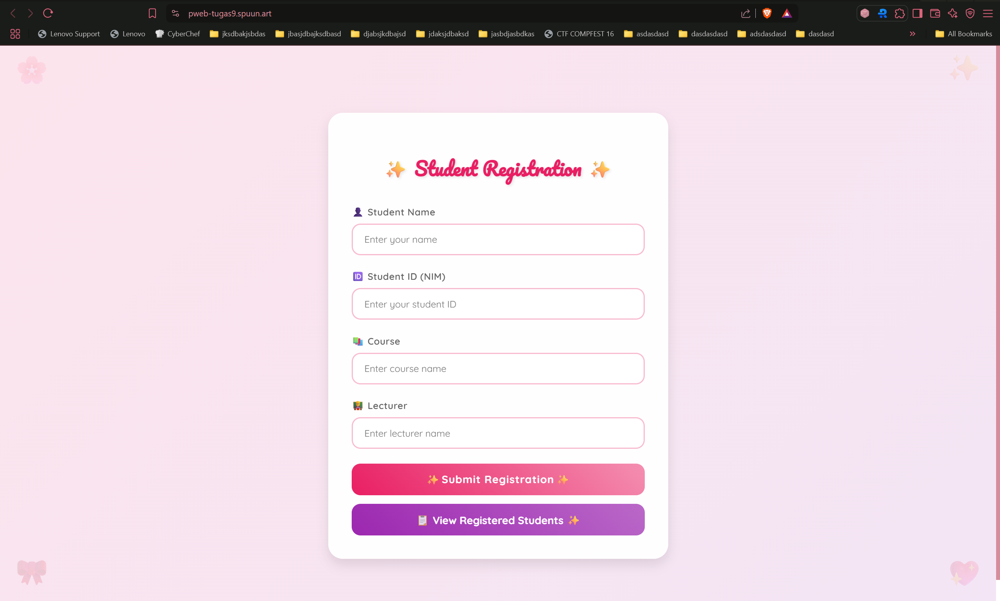
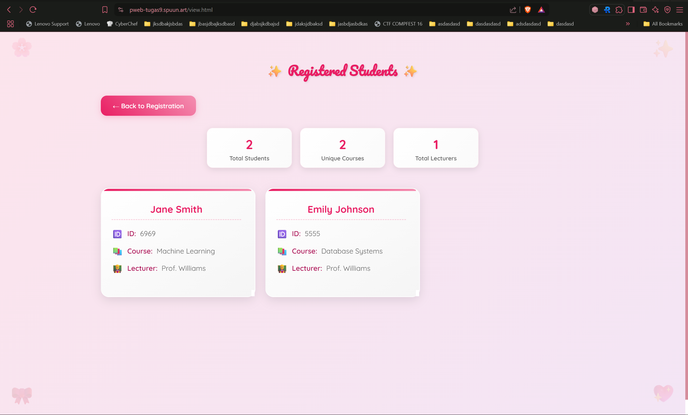
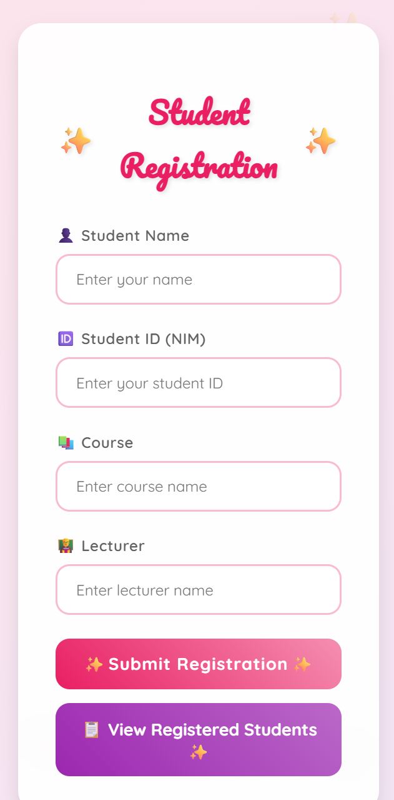
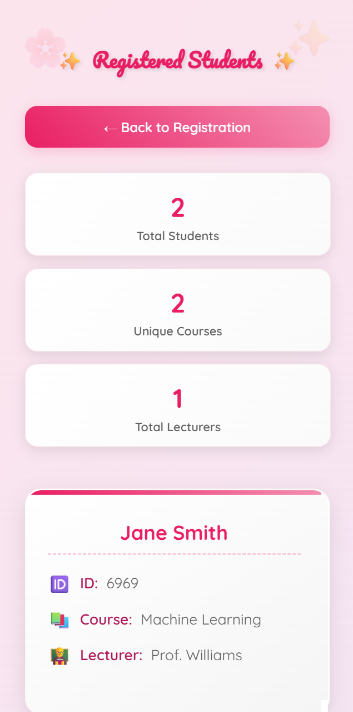
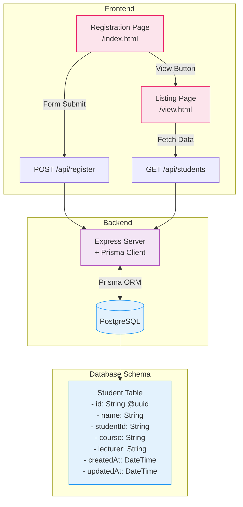

# **Web Programming 9th Assignment**

Faiz Muhammad Kautsar  
5054231013

View the deployed version at: [https://pweb-tugas9.spuun.art/](https://pweb-tugas9.spuun.art/)

I recycled the structure from the previous [`tugas-8`](../tugas-8/) assignment, migrated to a PostgreSQL database via [Supabase](supabase.com/), connected via the [Prisma ORM](https://www.prisma.io/). (https://tugas-9.vercel.app/).

Since this is practically the same as the previous assignment, all I did was I swapped it out for the backend to use an ORM, here I used Prisma ORM to do the schema, I had to modify some of the setup since the ORM requires us to rebuild the interface module component to prevent outdated cached modules (which would be at `/generated`, I set this to the `.gitignore` to omit it from commits intentionally).

Like the previous assignment, the UI designs _are_ responsive, with media queries coded in.

Currently, the flow looks something like this:

